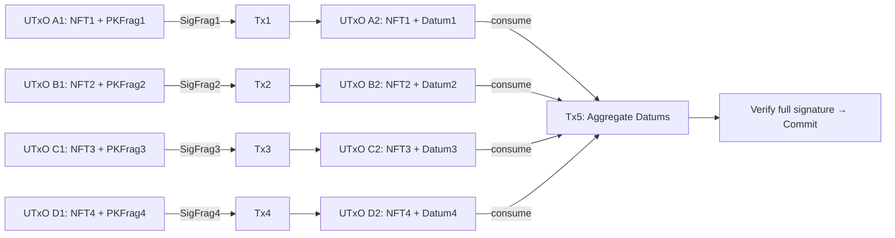
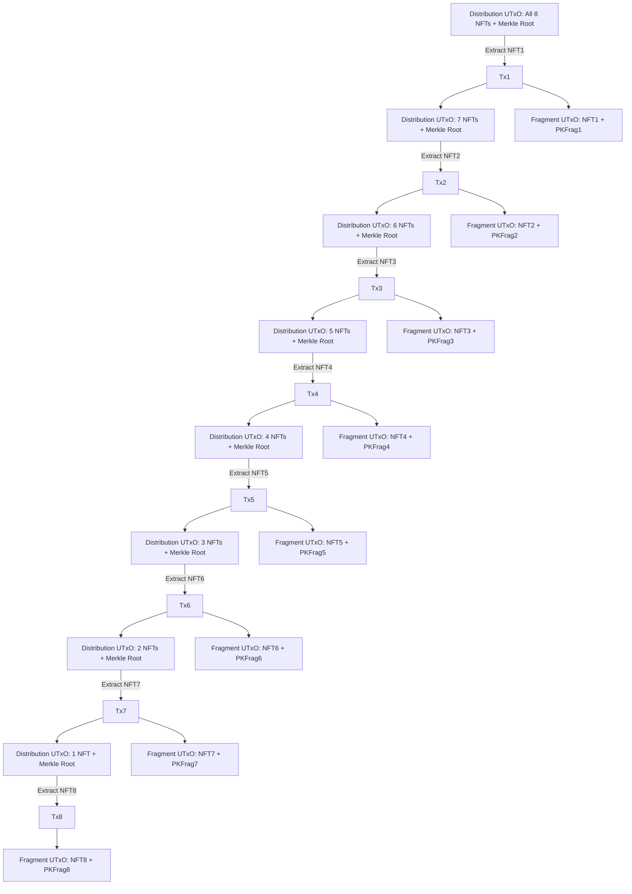

# An Approch to validating large lamport signatures over many transactions. 

## Introduction

Let eight non‑fungible tokens (NFTs), each linked to a distinct one‑eighth fragment of a public key, reside in eight separate UTxOs. To spend any given token, the user must supply the corresponding one‑eighth fragment of the signature; executing this step produces a successor UTxO that retains the NFT and carries a datum containing that fragment of the message hash.

In a final, ninth transaction, these eight UTxOs are consumed as inputs. Their datums are concatenated to reconstruct the complete message hash, at which point the protocol—now wielding the full cryptographic strength of the original key—confirms that the hash was indeed signed. If this reconstructed hash satisfies a predefined validation condition (for example, if its preimage accurately encodes the transaction’s inputs and outputs), the transaction is deemed valid and is committed to the chain.

The final transaction may also burn the tokens.

## Initializing

Because the full public key is too large to distribute its eight constituent fragments into their corisponding UTxOs in a single transaction, we must deploy it in stages:

### Collective Minting

In the first transaction, mint all eight NFTs into a single UTxO guarded by a distribution validator. The datum of this UTxO records the Merkle root of the eight key fragments, with each leaf committing to one fragment of the public key. Note that the position in the merkle tree reflects the fragments position in the full public key. 

### Iterative Fragment Extraction
To deploy an individual key public key fragment, spend the relevant NFT from the distribution UTxO and lock it with the corisponding public key fragment in the datum. The validator enforces that the key chunck is the leaf at the expected position in the merkle tree. 

~~The validator checks the NFT against the stored Merkle root, then outputs a new UTxO locked by the fragment‑revealing script. This new UTxO’s datum must contain exactly the public‑key fragment corresponding to the NFT’s index.~~

### Final Configuration
Repeating the fragment‑extraction step for each of the eight NFTs yields eight distinct UTxOs, each holding one NFT and its matching key fragment in a datum. At this point, the user needs to know what to sign and we consider the system to be initalized. 

